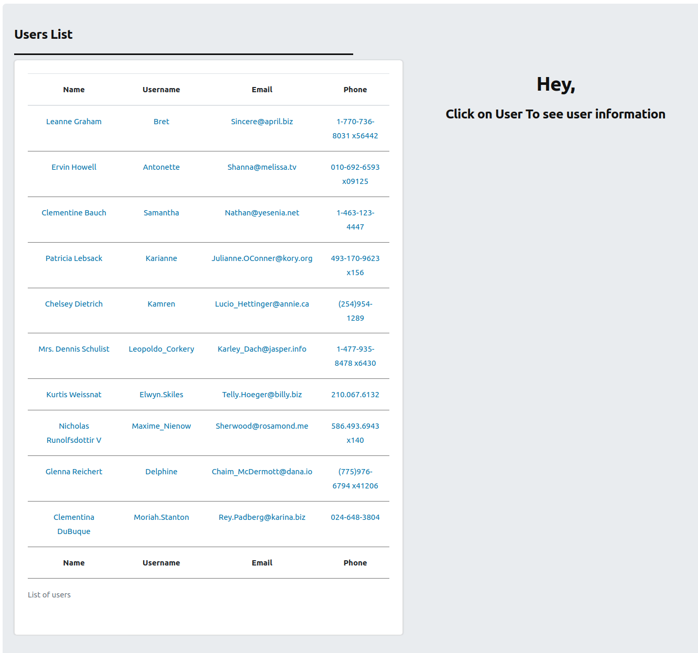
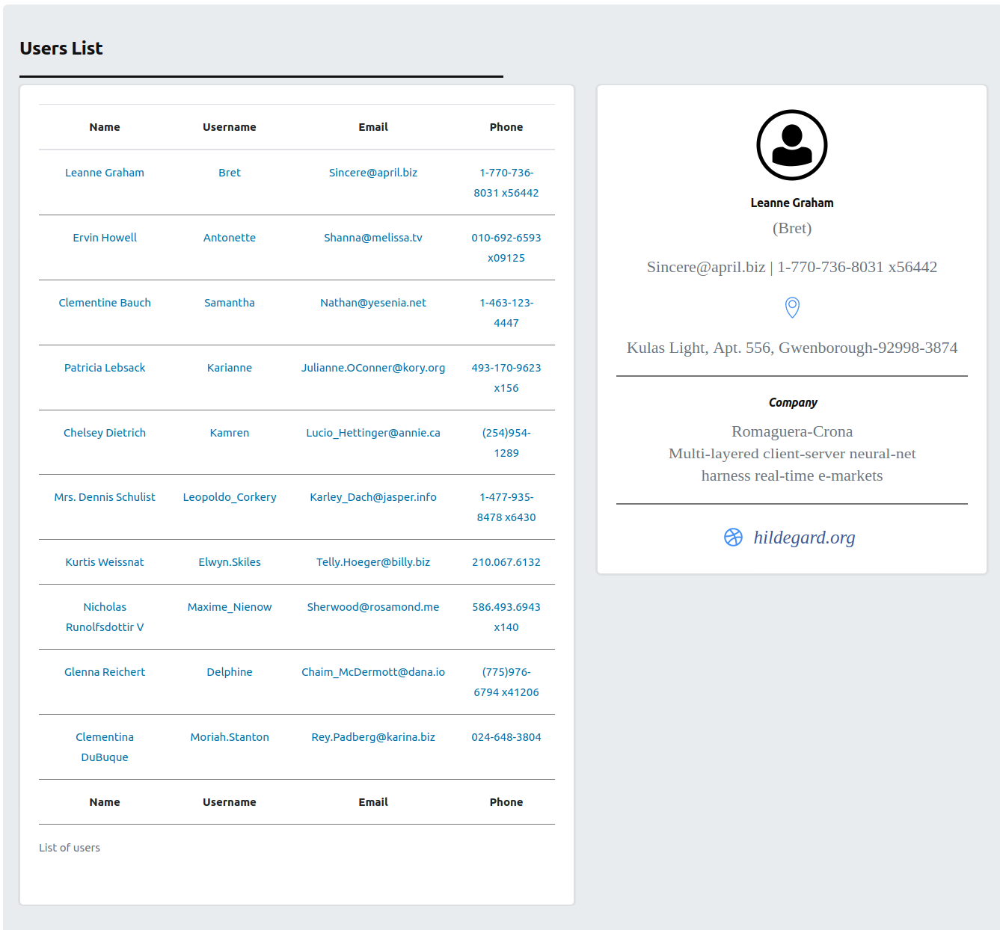

# Users List

License: GPL-2.0+ License URI: <http://www.gnu.org/licenses/gpl-2.0.txt>

# Purpose
The main purpose of this plugin is to explore WordPress plugin development and the WordPress API. The plugin was created using Object Oriented Constructs, and tested using PHPUnit. One can install the plugin using a composer package or manually.

# Requirements
**PHP Version:** >=7.2

**Wordpress:** ~5.7.2

**PHPUnit:** 7.* 

# Description
A simple plugin demo to list users from *external REST API Service* using object oriented constructs.This plugin listing users on custom endpoint that Wordpress doesn't recognise as a standard URL, like a post, permalink or so. 

Basically it uses Wordpress *Rewrite API* to create custom endpoint and *HTTP API* to get users from external service. Under the hood plugin also make the use of *Options API* - To  Store options on DB , *Settings API* - To add plugin settings page and *Transients API* -To cache users information.

# Installation Using Composer
- Clone repository to the ```wp-content/plugins/``` directory of your wordpress installation OR update your root composer.json with following details:
```
  "repositories": [
    {
      "type": "vcs",
      "url": "https://github.com/patelparixit07/users-list.git"
    }
  ],
  "require": {
    "patelparixit07/users-list": "dev-master"
  }
```
- Run composer install
- Activate the plugin through the *Plugins* menu in WordPress

# Usage
- Update plugin options from ```Settings => Users List```
- Browse endpoint URL from browser. ***For Example:*** 

    => If plugin option ***Endpoint*** set to **users**: ```https://example.com/users```

   => If plugin option ***Endpoint*** set to **users-list**: ```https://example.com/users-list```
> ***Note:*** ***Endpoint*** option should only be ```slug``` without any space
- Update ***Users API URL*** option to set URL from which plugin can fetch users list.
> *Care should be taken by setting this option:*
> - API Service return ```JSON``` response
> - It should contain user's basic information such as, ```name, username, email, phone etc.```
> - URL should be configured in way such that single user information can be fetch by passing user `id` as argument. ***For example:***  If this URL set to ```https://jsonplaceholder.typicode.com/users``` 
      Then single user information can be fetch by accessing ```https://jsonplaceholder.typicode.com/users/10```

- On this page click on any user to see information

# Screenshots

<div class="row">
  <div class="column">
    
  </div>
  <div class="column">
    
  </div>
</div>